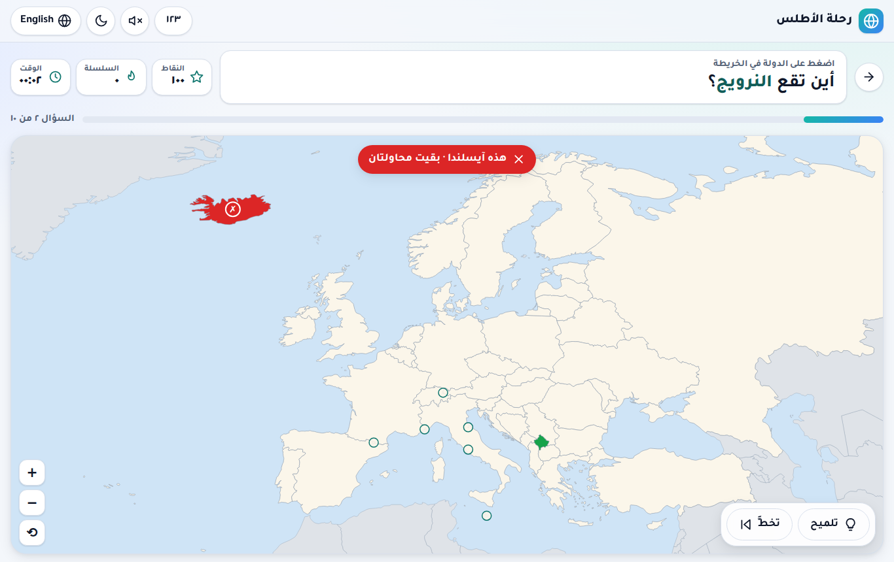
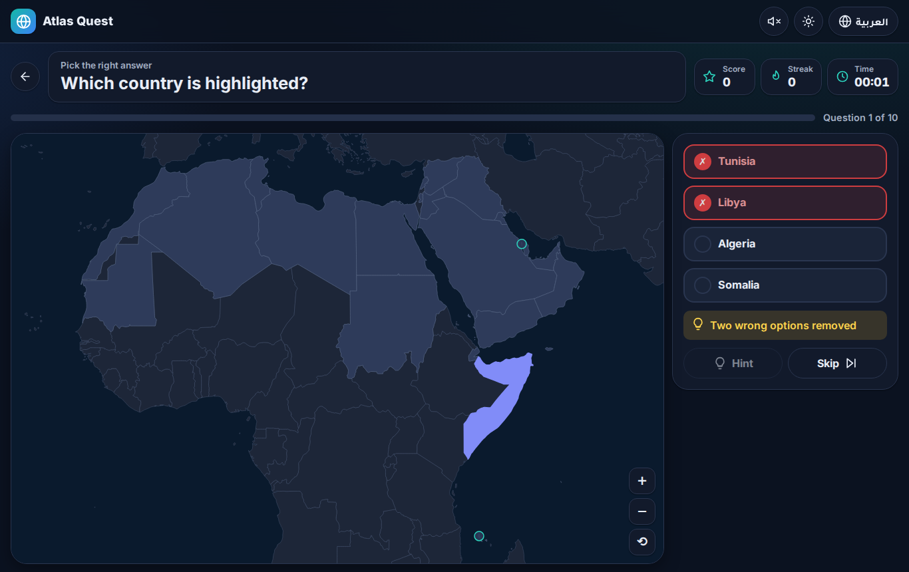
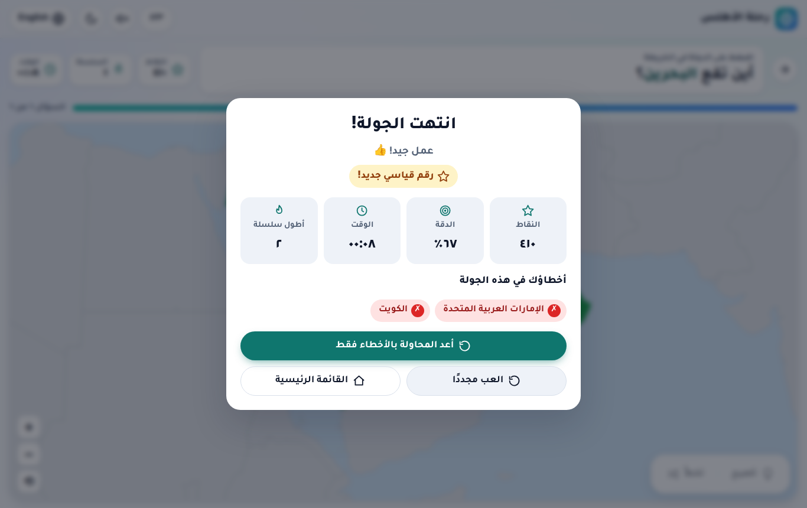
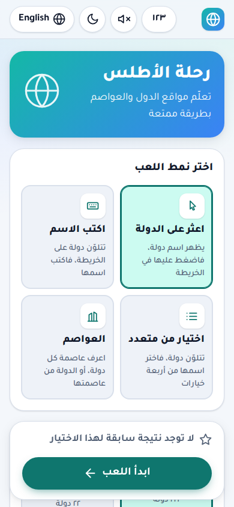
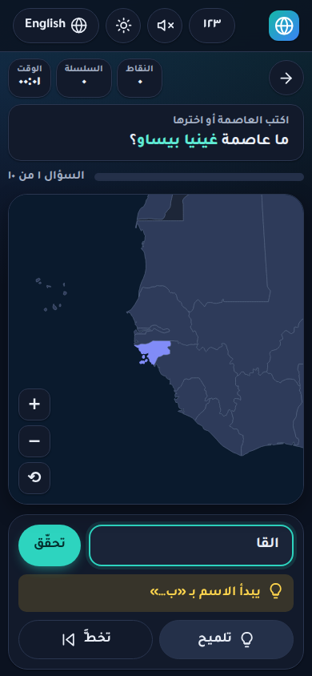
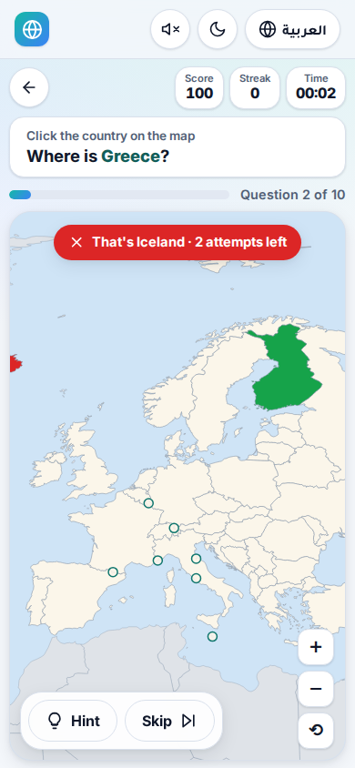

# رحلة الأطلس · Atlas Quest

An interactive, bilingual (Arabic / English) geography quiz inspired by Seterra. You learn where
countries and capitals are through short quiz rounds. It runs entirely in the browser: no backend,
no CDN, and it works offline once served.

لعبة جغرافيا تفاعلية باللغتين العربية والإنجليزية، مستوحاة من Seterra. تعمل بالكامل داخل المتصفح بلا خادم ولا CDN.

## Features

- **4 game modes:** find the country on the map · type the highlighted country · multiple choice ·
  capitals (country → capital or capital → country, answered by choice or by typing).
- **9 regions:** World, Arab World, Gulf States, Africa, Asia, Europe, North America, South America, Oceania.
- **3 levels** (which countries are asked): level 1 only famous countries, level 2 adds less-known
  ones, level 3 asks every country including microstates and small islands. Each country's level
  (`tier`) is set by the `TIER_1` / `TIER_3` lists in `src/data/countries.ts`; everything else is tier 2.
  Countries outside the chosen level are greyed out on the map, and best scores are kept per level.
- **3 difficulties:**

  | | Attempts | Hints | Timer |
  |---|---|---|---|
  | Easy | 3 | unlimited | elapsed time only; typed answers forgive one typo |
  | Medium | 2 | 3 per round | elapsed time only |
  | Hard | 1 | none | 12 s per question, with a time bonus |

- Score, streak bonus, progress bar, hints (map circle / first letters / 50-50), and a results screen
  that lists your mistakes with a **Retry mistakes only** button. Confetti plays on a high score.
  Sounds are synthesised with Web Audio and can be muted.
- An SVG map (d3-geo, Natural Earth 1:50m) with mouse-wheel/drag and pinch zoom. Small countries get
  tap circles, and tiny highlighted targets get an automatic zoom.
- **Arabic first:** real RTL (`dir`/`lang` on `<html>`), logical CSS properties only, mirrored
  directional icons, a self-hosted Tajawal font, and no `letter-spacing`. You can show digits as
  Arabic-Indic (١٢٣) or Western (123). Names inside sentences are wrapped in `<bdi>`.
  Switching language re-renders everything in place, without a reload.
- **Answer normalisation:** Arabic input ignores tashkeel/tatweel and treats أ/إ/آ/ا, ة/ه, ى/ي and
  ؤ/ئ as the same letter. It also ignores extra spaces and an optional "ال". English input ignores
  case, accents and punctuation. Alternative names are accepted in both languages
  (السعودية, الإمارات, أمريكا, بريطانيا, USA, UK, Ivory Coast, …).
- Settings, language, theme and high scores are saved in `localStorage`.
- Accessibility: native radio groups, keyboard play on the map (Tab + Enter), live regions,
  `aria-label`s, focus rings, and ✓/✗ marks plus a hatch pattern so results never rely on colour alone.
  `prefers-reduced-motion` is respected.

## Run it

```bash
cd geo-quiz
npm install
npm run dev          # http://localhost:5173 (development)
npm run build        # production build in dist/
npm run preview      # serve dist/ on http://localhost:4173
```

`dist/` is a static site. Any static server (nginx, `npx serve dist`, GitHub Pages, …) can host it.
It uses relative paths (`base: './'`), so it also works from a sub-folder. Browsers block ES modules
on `file://`, so serve it rather than double-clicking `index.html`.

## Play online (GitHub Pages)

`.github/workflows/deploy.yml` runs the unit tests, builds the game and publishes `dist/` to
GitHub Pages on every push to `main`. The game is at **https://bkr75.github.io/atlas-quest/**.

One-time setup: under **Settings → Pages → Build and deployment → Source**, choose **GitHub Actions**.
On a free GitHub plan, Pages also needs the repository to be public.

## Tests

```bash
npm test             # Vitest unit tests (data, normalisation, matching, scoring, engine, i18n, CSS hygiene)
npm run test:e2e     # Playwright: full rounds in every mode × both languages, touch/pinch on a phone, a11y, fonts
npm run screenshots  # desktop+mobile × ar+en × light+dark screenshots → test-results/screenshots
npm run check        # build + unit + e2e
```

Playwright builds the app and serves it on port 4173 automatically. Every e2e test fails if the
console logs any error or warning.

## Project layout

```
src/
  data/countries.ts     one row per country: ISO code, ar/en names, alternatives, capitals, regions
  data/regions.ts       region list + map view (bounds, projection rotation)
  data/world.topo.json  generated map (do not edit; see scripts/build-map.mjs)
  i18n/ar.json, en.json every UI string (nested keys, plural forms via Intl.PluralRules)
  i18n/index.ts         t(), tNode() (wraps values in <bdi>), number/percent/clock formatting
  lib/normalize.ts      Arabic/Latin answer normalisation
  lib/match.ts          answer matching (alternatives, optional single-typo tolerance)
  lib/scoring.ts        difficulty rules, points, streak, timer
  lib/storage.ts        localStorage settings + best scores
  game/engine.ts        pure game state machine (no DOM) — unit tested
  map/GeoMap.ts         SVG map: projection, zoom/pan/pinch, states, helpers, hints (lazy-loaded)
  ui/                   DOM helpers, icons, sound, confetti
  app.ts                screens and wiring
scripts/build-map.mjs   regenerates world.topo.json from world-atlas
tests/unit, tests/e2e
```

## Adding a language

1. Copy `src/i18n/en.json` to `src/i18n/xx.json` and translate every value. Keep the `{placeholders}`.
   Plural objects accept the CLDR categories `zero/one/two/few/many/other`.
2. Register it in `src/i18n/index.ts`: add `'xx'` to `Lang`, import the file into `DICTIONARIES`,
   and extend `dir()` if the language is RTL.
3. Country names: add `xx` / `altXx` (and capitals) fields to `Country` in `src/data/countries.ts`,
   then return them from `countryName()` / `capitalName()` in `i18n/index.ts` and from
   `countryNames()` / `capitalNames()` in `lib/match.ts`.
4. Update the language toggle in `app.ts` (`renderHeader`). With three or more languages, a
   `<select>` works better than a toggle.
5. The unit test `i18n.test.ts` checks that every language has exactly the same keys and placeholders.

## Adding a region

1. Add the id to the `RegionId` union in `src/data/countries.ts`, and tag the countries
   (`regions: [...]`).
2. Add an entry to `REGIONS` in `src/data/regions.ts` with an emoji, the map `bounds`
   (`[[west, south], [east, north]]`) and a projection `rotate` (minus the centre longitude).
3. Add `region.<id>` to every translation file.

## Data and editorial decisions

- **Map:** Natural Earth 1:50m through `world-atlas@2` (public domain), bundled locally.
  `npm run build:map` regenerates it and fails if any country lacks a shape.
- **196 playable countries:** the 193 UN members minus Tuvalu (Natural Earth 1:50m has no shape for
  it), plus Palestine and the Vatican (UN observer states), Kosovo and Taiwan (included by Seterra too).
  Somaliland is merged into Somalia and Northern Cyprus into Cyprus. Western Sahara, Greenland and
  other dependent territories are drawn in grey and cannot be played.
- **Capitals mode** leaves out Israel and Palestine because their capitals are internationally
  disputed. Both are still in every other mode.
- **Transcontinental countries:** Russia, Turkey and Cyprus appear in both Europe and Asia.
  Central America and the Caribbean belong to North America.
- Arabic names follow common Arabic usage (Arabic Wikipedia / Arab League media): for example
  ساحل العاج, جمهورية الكونغو الديمقراطية, ميانمار, إسواتيني. Common alternatives are accepted when typing.

## Screenshots

| Find the country (ar, desktop) | Multiple choice with 50/50 hint (en, dark) | Results (ar) |
|---|---|---|
|  |  |  |

| Home (ar, phone) | Typing capitals + hint (ar, dark, phone) | Find (en, phone) |
|---|---|---|
|  |  |  |
